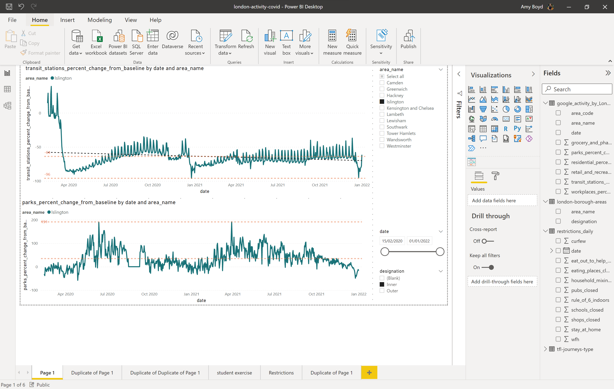
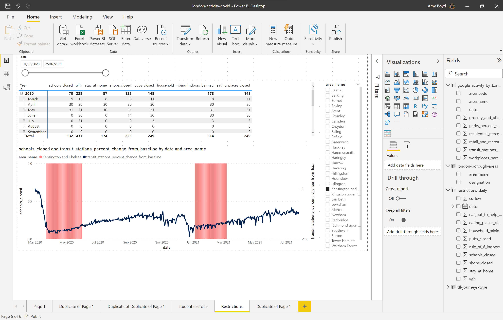

## Section 1: 

Explore the [London Borough Google Activity dataset](https://data.london.gov.uk/dataset/public-transport-journeys-type-transport) in Power BI and form hypothesis about the historical data. Connect a second dataset to the insights in Power BI ([COVID-19 Restrictions Time series - London Datastore](https://data.london.gov.uk/dataset/covid-19-restrictions-timeseries))

Using Power BI to explore datasets and understand data structure, patterns and insights:

**Using London Activity Data only:**

**Adding in Daily Restriction Data to add more value:**

## Datasets used:
*You can also update these datasets over time to reflect the latest data/timeline*

* [Google Mobility by Borough](https://data.london.gov.uk/dataset/google-mobility-by-borough)
* [TFL journey types](https://data.london.gov.uk/dataset/public-transport-journeys-type-transport)
* Manufactured dataset of London boroughs using website:  

## Extra Reading Links:
