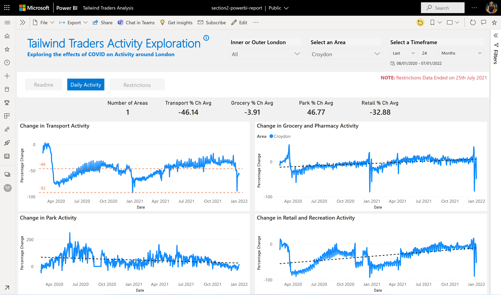
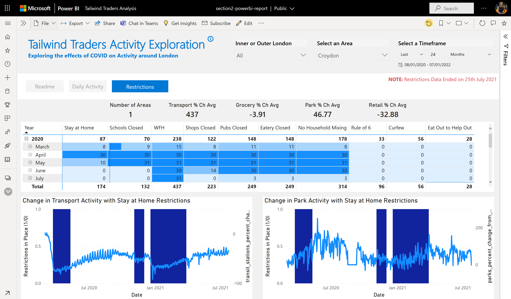

## Section 2: 

Now we understand the data, create and share Power BI reports/dashboards with business users at Tailwind Traders. Tell a story back to the business of the data and recommend some next steps for further investigation

Taking simple data investigation for a data analyst/data scientist and changing into a useable report with pages, filters, titles and easy to read layout

[Link to slides](https://gaicstor2020.blob.core.windows.net/amy-ppts/ImplementingAIendtoendinthecloudwithAzure.pptx)

[Link to Tailwind Traders Report PBIX file](section2-powerbi-report.pbix)

**Tailwind Traders Report: Daily Activity Page**

**Tailwind Traders Report: Restrictions Page**

## Extra Reading Links:

*and frequently asked questions from the session*
* [Python in Power BI example](https://towardsdatascience.com/using-python-in-power-bi-ee95a6b71443)
* For any data at scale Azure Synapse Analytics is a perfect partner for Power BI: [Guy In A Cube Video](https://www.youtube.com/watch?v=vOSzw40TohM)
* [Power BI report templates](https://docs.microsoft.com/en-us/power-bi/create-reports/desktop-templates)