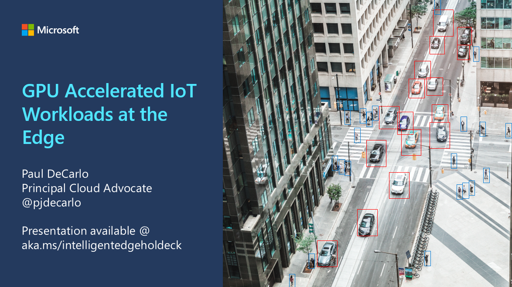

## Section 3: 

We are now ready to introduce how to employ various IoT technologies in and around our stores to analyze footfall using a production-grade architecture that allows for remote management, over the air updates, and customized reporting. In this section, Paul DeCarlo will share insights on implementation patterns for Computer Vision using Azure IoT Edge, Azure IoT services, and NVIDIA Jetson Hardware.

## Extra Reading Links:

* **GPU Accelerated IoT Workloads at the Edge - Presentation**

    * **[GPU Accelerated IoT Workloads at the Edge (PDF)](https://github.com/toolboc/Cloud-Powered-App-Development-Curriculum/raw/master/Day3/Content/01%20-%20GPU%20Accelerated%20IoT%20Workloads%20at%20the%20Edge.pdf)**

    * **[GPU Accelerated IoT Workloads at the Edge (PowerPoint)](https://github.com/toolboc/Cloud-Powered-App-Development-Curriculum/raw/master/Day3/Content/01%20-%20GPU%20Accelerated%20IoT%20Workloads%20at%20the%20Edge.pptx)**

* **Intelligent Home Security with NVIDIA Jetson - Presentation**

    * **[Intelligent Home Security with NVIDIA Jetson (PDF)](https://github.com/toolboc/Cloud-Powered-App-Development-Curriculum/raw/master/Day4/Content/01%20-%20Intelligent%20Home%20Security%20with%20NVIDIA%20Jetson.pdf)**

    * **[Intelligent Home Security with NVIDIA Jetson (PowerPoint)](https://github.com/toolboc/Cloud-Powered-App-Development-Curriculum/raw/master/Day4/Content/01%20-%20Intelligent%20Home%20Security%20with%20NVIDIA%20Jetson.pptx)**

* **Intelligent Video Analytics with NVIDIA Jetson and Microsoft Azure**

    * **[Intelligent Video Analytics with NVIDIA Jetson and Microsoft Azure - Github Repo](https://aka.ms/intelligentvideoanalytics)**